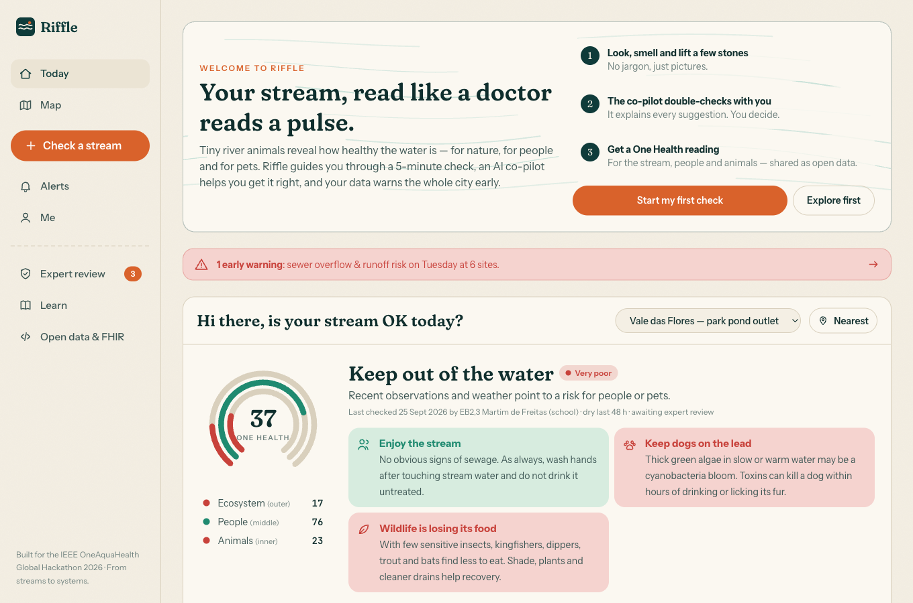
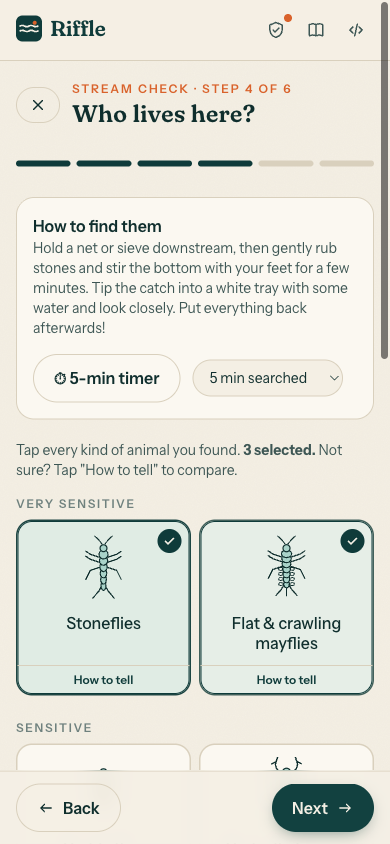
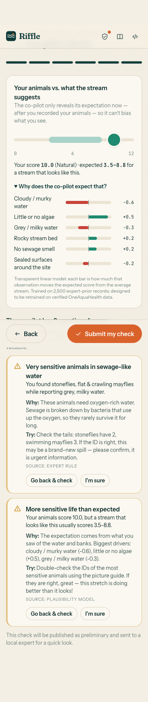
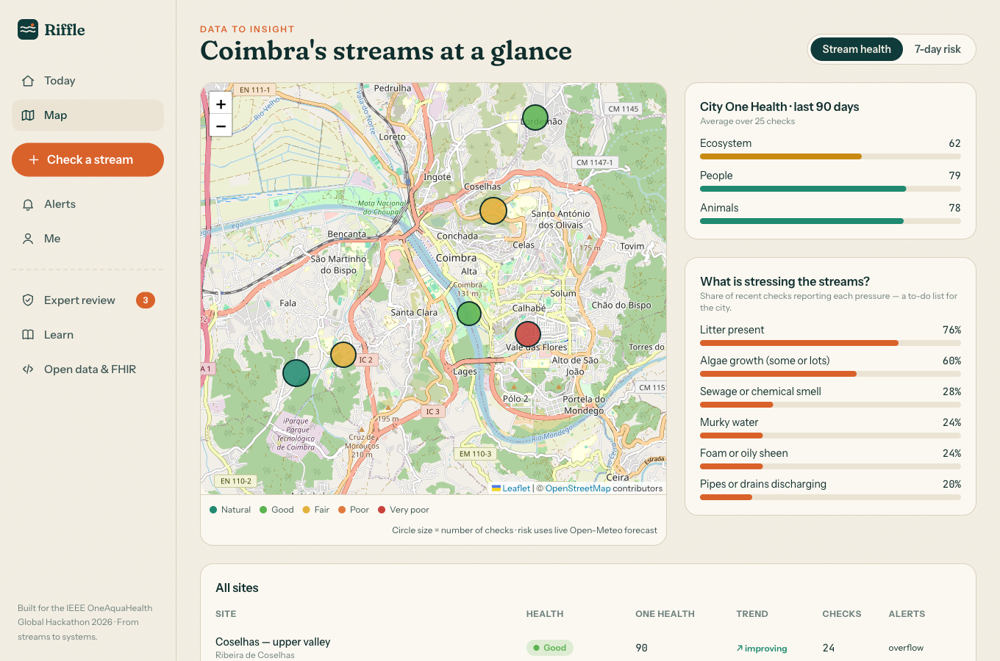
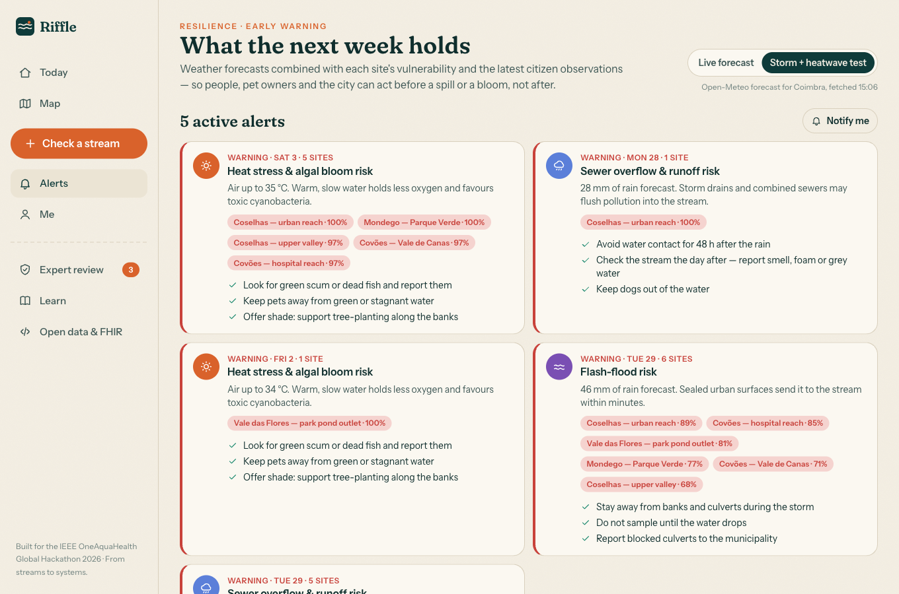
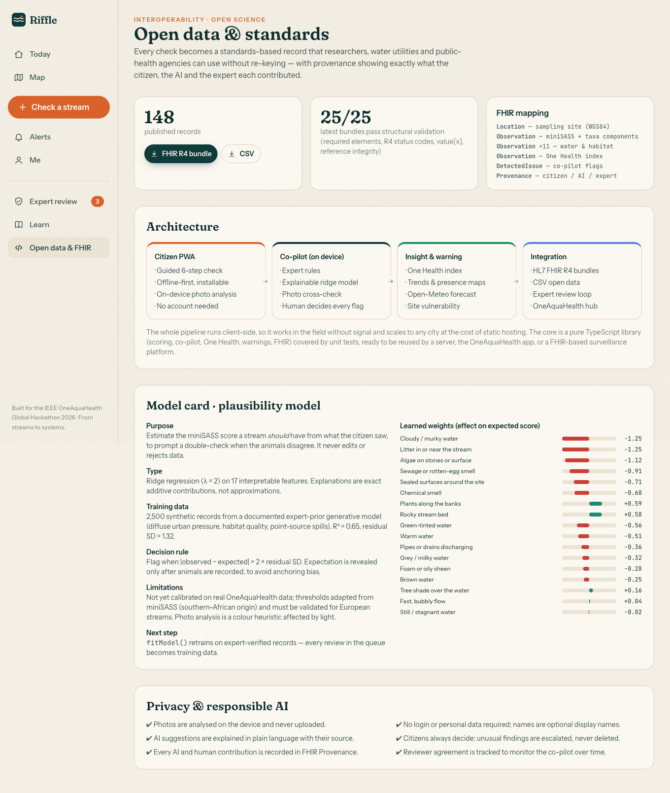

# Riffle — an explainable AI co-pilot for citizen stream science

> **From streams to systems.** A 5-minute guided stream check, an AI co-pilot that double-checks *with* citizens (never instead of them), and a One Health reading that warns people, pet owners and cities before a spill or a bloom — exported as HL7 FHIR R4.

Built for the **IEEE OneAquaHealth Global Hackathon 2026**.

**▶ Live demo:** https://karan6705.github.io/riffle/ · **🎬 Demo video (4 min, narrated + captions):** [riffle-demo.mp4](https://github.com/karan6705/riffle/releases/download/v1.0/riffle-demo.mp4)

| | |
|---|---|
| **Primary track** | **Track 3 — AI-Supported Assessment** (explainable AI, validation checks, human-in-the-loop) |
| **Also delivers** | Track 1 Citizen Science UX · Track 2 Data-to-Insight · Track 4 Storytelling · Track 5 Gamification · Track 6 Early warning · Track 7 FHIR interoperability |
| **Demo data** | Urban streams of Coimbra, Portugal (Ribeira de Coselhas, Ribeira dos Covões, Vale das Flores, Rio Mondego) — synthetic, approximate coordinates |
| **Stack** | React 19 · TypeScript 7 · Vite 8 · Tailwind 4 · Leaflet/OpenStreetMap · Open-Meteo · Vitest |



---

## The problem

Urban streams are monitored far too rarely for the speed at which they change. Citizen science can fill the gap, but:

1. **Tools are hard to use.** Ecological jargon and complex protocols put people off (Track 1).
2. **Citizen data is noisy.** Misidentified animals and inconsistent answers make experts distrust it (Track 3).
3. **Data rarely becomes action.** A score in a spreadsheet does not tell a parent whether their child can paddle today (Tracks 2, 4, 6).
4. **Data stays siloed.** Environmental records do not reach public-health systems (Track 7).

## The solution

### 1 · A guided check anyone can do (Track 1)
Six short steps, all in plain language with pictures: **place → water → banks → animals → photo → co-pilot**.

- Water colour swatches, smell and flow tiles. No jargon; a glossary maps each plain word to the scientific term.
- A **"bug hunt"** with 13 procedurally drawn macroinvertebrate groups (the miniSASS method), each with a "How to tell" guide for its key ID features (number of tails, gills, cases).
- A built-in **5-minute sampling timer**, GPS pin or tap-on-map, and new-site creation.
- An optional **water photo analysed on the device**, using the white-cup method.



### 2 · An explainable AI co-pilot with a human in the loop (Track 3 — core)
The co-pilot combines three independent sources of evidence:

| Source | What it catches | Example |
|---|---|---|
| **Expert rules** | Ecologically implausible combinations and impossible values | Stoneflies reported alongside a sewage smell; 64 °C (it points out this is probably 17.8 °C in Fahrenheit) |
| **Plausibility model** | Bugs that disagree with the stream's appearance | Ridge regression predicts the expected miniSASS score from 17 water and habitat observations; flags when \|observed − expected\| > 2σ |
| **Photo analysis** | A mismatch between the photo and the reported colour | HSV colour analysis of the water in a white cup, entirely on the device |

**Responsible-AI design choices**
- **No anchoring bias.** The model's expectation is revealed only *after* the citizen has recorded their animals.
- **Exact explanations.** Each flag shows the observations that drove it, as additive contributions ("Cloudy water −0.6, Little or no algae +0.5").
- **The citizen decides.** They can *go back and check* (the flag resolves automatically if the answer changes) or *confirm with a note*. Nothing is edited or deleted automatically.
- **Unusual isn't wrong.** Unresolved flags are published as *preliminary* and sent to an **expert review queue**. There experts see the citizen's note beside the model's evidence and verify or reject in seconds.
- **The co-pilot is audited.** The review page tracks how often flagged records turn out to be valid.
- **Provenance travels with the data.** The citizen (author), the co-pilot (verifier) and the expert (attester) are all recorded in FHIR `Provenance`, and each flag becomes a `DetectedIssue`.
- There is a **model card** in the app: purpose, training data, R², decision rule, limitations and retraining path.



### 3 · From observation to insight (Track 2)
- **One Health index.** Each check is read three ways: **ecosystem** (miniSASS + habitat), **people** (sewage, blooms, rain-driven overflow) and **animals** (cyanobacteria risk for dogs, heat, food-web loss). Each reading comes with audience-specific advice.
- **City map.** Sites are coloured by health or by 7-day risk. The map also shows a **"what is stressing the streams"** ranking and city-wide One Health averages.
- **Site pages.** A trend chart (with a moving average), a **who-lives-here presence heat map** per quarter (sensitive groups vanishing is an early warning in itself), a visit history and a 7-day outlook.



### 4 · Early warning & resilience (Track 6)
- A **live Open-Meteo forecast** (free, keyless) is combined with each site's **vulnerability** (sealed surfaces) and its **latest citizen observations** (outfalls, algae, still water).
- It covers three hazards: **sewer overflow and runoff**, **heat stress and algal blooms**, and **flash floods**. The formulas are transparent and documented in the app.
- Alerts are grouped by hazard and day, list the affected sites, give concrete actions, and can trigger browser notifications.
- A **"storm + heatwave" stress-test scenario** shows the alerting on a calm week, and is used automatically when the app is offline.



### 5 · Awareness & storytelling (Track 4)
- **"One raindrop, three kinds of health":** a story that follows one storm from rooftops to sewer overflow to suffocating stoneflies to a poisoned dog, and ends with a neighbour who noticed first.
- An interactive One Health diagram, a jargon translator and a quick quiz.

### 6 · Engagement that rewards good science (Track 5)
- **XP and levels** (Tadpole → River Guardian) that reward **careful** science, not just volume: extra XP for a 5-minute search, a photo, a temperature reading, correcting a flagged answer, or explaining an unusual finding.
- **Badges** such as *Honest Scientist* (corrected a flagged entry), *Stonefly Spotter* and *Site Adopter*. There are also weekly **challenges**, a community challenge and a leaderboard ranked by **trusted checks × data quality**.

### 7 · Interoperability (Track 7)
Every check exports as an **HL7 FHIR R4 `Bundle`**:

```
Bundle (collection)
 ├─ Location          sampling site, WGS84 position
 ├─ Observation       miniSASS score + one component per animal group (valueBoolean)
 ├─ Observation ×11+  water & habitat findings (UCUM units: Cel, %)
 ├─ Observation       One Health index (ecosystem / people / animals components, derivedFrom)
 ├─ DetectedIssue ×n  co-pilot flags + citizen mitigation
 └─ Provenance        author (citizen) · verifier (co-pilot) · attester (expert)
```

- **Status follows the review.** Records awaiting review are `preliminary`, published ones are `final`, and rejected ones are `entered-in-error`.
- **Idempotent re-export.** IDs are deterministic and UUID-shaped.
- **Built-in validator.** It checks required elements, R4 status codes, `value[x]` exclusivity and that every `urn:uuid` reference resolves. It runs live on every record.
- **Bulk export.** The whole dataset downloads as a FHIR bundle or as CSV.



---

## Architecture

```
┌──────────────────┐   ┌─────────────────────┐   ┌──────────────────────┐   ┌────────────────────┐
│  Citizen PWA     │ → │ Co-pilot (on device)│ → │ Insight & warning    │ → │ Integration        │
│  guided check    │   │ rules · ridge model │   │ One Health index     │   │ FHIR R4 bundles    │
│  offline-first   │   │ photo cross-check   │   │ trends · presence    │   │ CSV open data      │
│  photo analysis  │   │ human decides       │   │ Open-Meteo + vuln.   │   │ expert review loop │
└──────────────────┘   └─────────────────────┘   └──────────────────────┘   └────────────────────┘
```

```
src/
├─ core/                 ← pure TypeScript domain library (no UI) — unit tested
│  ├─ taxa.ts            macroinvertebrate groups, plain-language ID guides
│  ├─ scoring.ts         miniSASS score & ecological categories
│  ├─ model.ts           explainable ridge regression + expert-prior simulator
│  ├─ copilot.ts         validation rules, model & photo checks, HITL routing
│  ├─ photo.ts           on-device water colour analysis
│  ├─ onehealth.ts       ecosystem / people / animals index + advice
│  ├─ warning.ts         Open-Meteo client, hazard model, alert grouping
│  ├─ fhir.ts            FHIR R4 Bundle builder + structural validator
│  ├─ gamification.ts    XP, levels, badges, streaks
│  └─ seed.ts            Coimbra demo dataset with site storylines
├─ state/                zustand store (persisted), forecast, derived summaries
├─ components/           layout, procedural bug illustrations, charts, maps
└─ pages/                Today · Check · Map · Site · Alerts · Review · Learn · Me · Record · Data
```

**Why it scales**
- **Zero backend to start.** It's a static PWA (hash routing, relative base) that runs on GitHub Pages or any CDN, costing almost nothing per city.
- **Works in the field without signal.** A service worker caches the app shell and map tiles, and checks are stored on the device.
- **The core library is portable.** The same `src/core` could run in a Node API, in the OneAquaHealth app, or on a FHIR server (e.g. HAPI) behind a `POST /Bundle`.
- **Adding a new city is data, not code.** Add sites and their vulnerability; the forecast adapts to their coordinates.

## Run it

```bash
npm install
npm run dev        # http://localhost:5173
npm test           # 28 unit tests for the domain core
npm run build      # typecheck + production build to dist/
npm run preview    # serve the production build
```

The demo video is fully reproducible: `video/narration.json` holds the script, `video/record.cjs` drives the live app with Playwright in time with the narration, and `video/build.py` adds the voice-over and captions with ffmpeg.

Deploy: push to GitHub and enable **Pages → GitHub Actions**; the included workflow builds and publishes `dist/`.

## Scientific basis & honesty notes

- **Scoring** follows the miniSASS citizen biomonitoring method (GroundTruth / Water Research Commission): average sensitivity of the groups found, interpreted separately for rocky and sandy beds. Its thresholds come from southern Africa and **must be calibrated for European streams**; this is a first task for a real deployment with OneAquaHealth partners.
- **Model training data** is **synthetic**, from a documented generative model of expert priors (diffuse urban pressure, habitat quality, point-source spills). `fitModel()` is generic, so every expert-verified record from the review queue can become real training data.
- **Photo analysis** is a transparent colour heuristic, not a trained classifier. Lighting can fool it, so it only *asks*; it never decides.
- **The demo dataset is synthetic.** It uses real stream names but approximate coordinates. The weather forecast is **live**.
- **Hazard formulas** are transparent logistic curves, designed to be calibrated with sensor and outcome data.

## Roadmap
1. Calibrate thresholds and retrain the model on expert-verified OneAquaHealth records.
2. Add Portuguese and other partner-city languages (all copy is already in plain, translatable strings).
3. Add a backend sync API that POSTs FHIR bundles to a FHIR server, with a SMART-on-FHIR dashboard for public-health teams.
4. Add image-based macroinvertebrate ID as a *suggestion* inside the same human-in-the-loop flow.
5. Send push alerts per adopted site, plus subscriptions for municipal teams.

## License
MIT. Map data © OpenStreetMap contributors; weather by [Open-Meteo](https://open-meteo.com).
